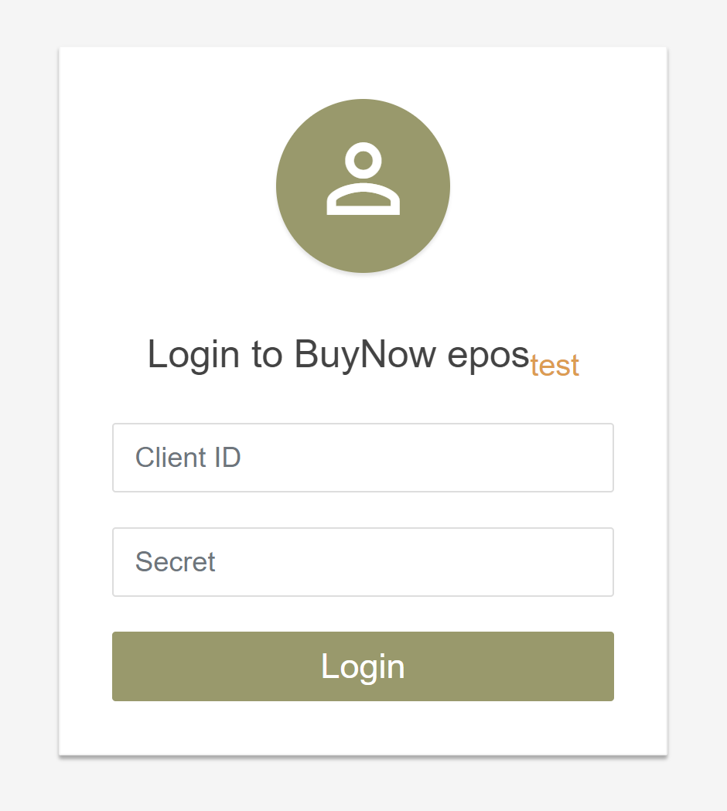

## Описание 
**BuyNow EPOS** - простая интеграция Вашего сайта с платежной системой EPOS!

Нет необходимости перехода на CMS системы с модулями электронной коммерции.
* Подходит для создания заказов со страниц социальных сетях
* BuyNow EPOS позволят самостоятельно сгенерировать уникальную ссылку для оплаты Вашего товара (или группы товаров). Данную ссылку, ввиде кнопки, необходимо просто добавить на сайт (страницу) с описанием товара или услуги.

При нажатии на ссылку клиент будет перенаправлен в корзину с товарами, где закончит оформление заказа и сможет выполнить его оплату. Платежная ссылка также может быть отправлена менеджером клиенту любым удобным способом (по email или в мессенджеры)

## Осноные понятие системы
* **Магазин** - набор настроек, обеспечивающих взаимодействие c EPOS. Большая часть настроек будет отправлена службой поддержки EPOS. У одного поставщика услуг, может быть несколько магазинов с разными настройками
* **Товар** - товар или услуга, реализуемая поставщиком
* **Корзина** - группа товаров доступных для оплаты. Администратор самостоятельно создает корзину, добавляя в нее товары. Именно ссылка на корзину будет доступна клиенту. В простейшем случае в корзине будет один товар
* **Заказ** - оформленный клиентом заказ на оплату корзины

## Инструкция по настройке
### Авторизация
</img>
</img>

</img>

* Адреса:
    * Реальная система https://cmsgate.esas.by/cmsgate-buynow-epos/
    * Тестовая система https://cmsgate-test.esas.by/cmsgate-buynow-epos/
* Зайдите в административную часть платформы (admin/login), используя авторизационные данные, полученные от службы поддержки epos

### Создание магазина
* Перейдите в меню [Настройки магазинов] (admin/shop_configs) и добавьте новый магазин. Указав необходимые настройки:
    * EPOS процессинг - выбор организации, выполняющей интеграцию с EPOS
    * Код ПУ – код поставщика услуги в системе EPOS
    * Код услуги EPOS – код услуги у поставщика услуг в системе EPOS (один ПУ может предоставлять несколько разных услуг)
    * Код торговой точки – код торговой точки ПУ (у одного ПУ может быть несколько торговых точек)
    * Срок действия счета - как долго счет, будет доступен в ЕРИП для оплаты
    * Секция "Инструкция" - если включена, то на итоговом экране клиенту будет доступна пошаговая инструкция по оплате счета в ЕРИП
    * Секция QR-code - если включена, то на итоговом экране клиенту будет доступна оплата счета по QR-коду
    * Секция Webpay - если включена, то на итоговом экране клиенту отобразится кнопка для оплаты счета картой (переход на Webpay)
    * Текст успешного выставления счета - текст, отображаемый кленту после успешного выставления счета. Может содержать html. В тексте допустимо ссылаться на переменные @order_id, @order_number, @order_total, @order_currency, @order_fullname, @order_phone, @order_address
    * Название настроек – название отображаемое в административной части системы. Используется при привязке корзины товаров к магазину
    * Активность – только корзины привязанные к активному магазину доступны клиентам для оформления заказа
    
### Создание товара
* Перейдите в меню [Товары] (admin/products) и добавьте новый товар, указав необходимые параметры:
    * SKU – Ваш внутренний артикул товара
    * Name – кратое название товара/услуги
    * Image – url на картинку с товаром. Будет отображаться клиенту при оформлении заказа
    * Description – полное описание товара
    * Active – активность товара. Только активные товары будут отображаться клиентам при оформлении заказа
    
### Создание корзины
* Перейдите в меню [Корзины] (admin/ baskets) и добавьте новый корзину, указав необходимые параметры
    * Name – краткое название корзины товаров
    * Description – подробное описание группы товаров. Будет отображаться клиентам при оформлении заказа
    * Shop config – привязка к созданным ранее настройкам магазина
    * Active – активность корзины
    * Ask name? – необходимо ли запрашивать ФИО клиента при оформлении заказа
    * Ask email? – необходимо ли запрашивать email клиента при оформлении заказа
    * Ask phone? – необходимо ли запрашивать номер телефона клиента при оформлении заказа
    * Return url – адрес Вашего сайта на который клиент сможет перейти в процессе или после оформления заказа
    * UI css url – ссылка на внешний css для кастомизации внешнего вида корзины
* После добавления новой корзины необходимо перейти к ее редактированию
    * В верхней части страницы появится панель с уникальной ссылкой для клиента. Именно эту ссылку необходимо использовать на своем сайте/страницы для перенаправления клиента на офрмление заказа. 
    * В нижней части стрианцы появится таблица для добавления товаров в корзину. При добавлении товара можно указать 
        * Initial Count – начальное количество товаров в корзине
        * Max Count – максимальное количество товаров в корзине, которое может задать клиент при оформлении заказа
        
### Просмотр заказов
* Перейдите в меню [Закзаы] (admin/orders) и просмотрите актуальный список заказов, созданных Вашими клиентами, через систему BuyNow EPOS. После оплаты заказа в системе EPOS его статус изменится, автоматически.
* При переходе в детали заказа в верхней части страницы отображается уникальная ссылка для оплаты именно этого заказа. В случае создания заказа менеджеров в ручном режиме эта ссылка может быть отправлена клиенту любым удобным способом
        
    
    

